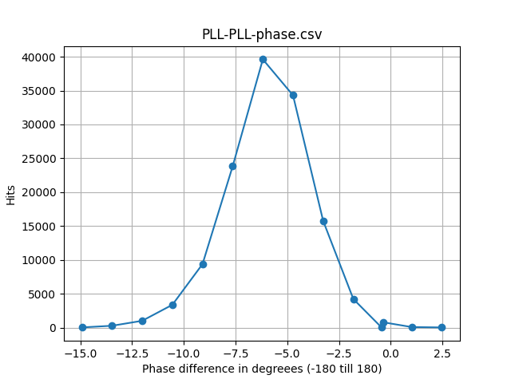
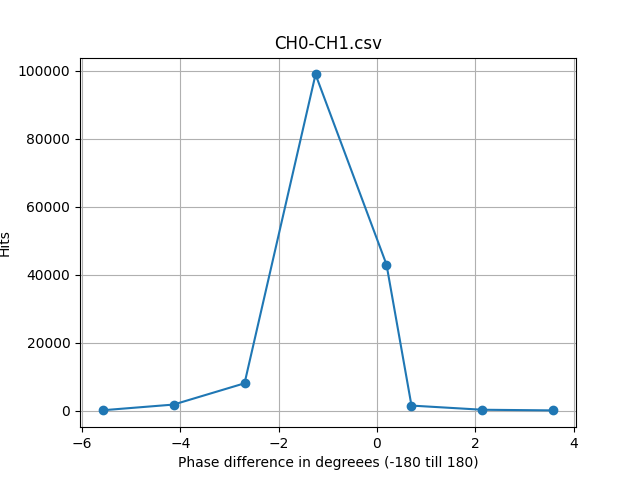
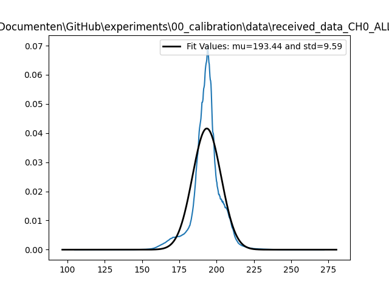
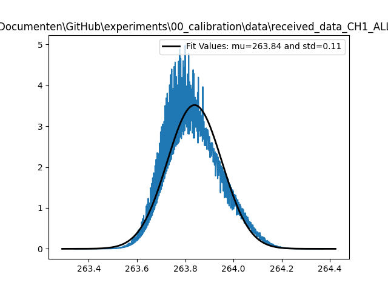

# Calibration Procedure

- ⬛ PPS Stability Tests
- ⬛ 10 MHz Time offset Stability Test
  * ⬛ Time offset stabibility measurements with 1 octoclocks and 2 scope channels
  * ⬛ Time offset stabibility measurements with 3 octoclocks and 3 scope channels
- ⬛ PLL Phase Stability Test
  * ☑️ PLL Phase when clocked from the same Octoclock
  * ⬛ PLL Phase when clocked from different Octoclock
  * ⬛ PLL Phase Noise (or phase stability) from same/different Octoclock
- ⬛ USRP Phase Stability Test   
  * ☑️ USRP CH0-CH1 Phase stability
  * ⬛ USRP0 CH0 USRP1 CH0 Phase stability
- ⬛ PLL-USRP Sync
  * ⬛ PLL-RX CH0 Phase stability
- ⬛ USRP Loopback Sync
  * ⬛ TX CH0-RX CH0 Phase stability
- ⬛ USRP Ref Sync
  * ⬛ PLL + loopback


## 10 MHz Time offset Stability Test
Measurements have revealed that the 10MHz signals are not perfectly time synchronous. Time offsets between rising edges of several tens of picoseconds are not uncommon. The onboard components of the CDA2990 are responsible for this undesired effect, including the cdce18005 clock buffer IC. To determine whether it is worthwhile to map these (rising edge) time differences, it is important to know if these offsets do not vary too much over time. The following figure depicts a measurement setup proposed to measure the offsets over several days/weeks.


Measurement results using three octoclocks.
Octoclock [L1] connected to scope [CH1], Octoclock [L2 NR1] connected to scope [CH2], Octoclock [L2 NR2] connected to scope [CH3].
In the most ideal scenario, the time difference between CH2 and CH3 would be zero.

| Date | Time | Δt [CH1-CH2] | Δt [CH2-CH3] | Δt [CH1-CH3] | Pwr cycled? | ON (t > 24h) |
|-|-|-|-|-|-|-|
| 15/03/2024 | 9:44 | 45.552 ns | 285 ps | 45.209 ns | yes | no |
| 18/03/2024 | 9:11 | 45.548 ns | 270 ps | 45.209 ns | no | yes |
| 22/03/2024 | 10:43 | 45.523 ns | 257 ps | 45.237 ns | no | yes |
| 25/03/2024 | 09:46 | 45.552 ns | 256 ps | 45.323 ns | no | yes |
| 26/03/2024 | 15:37 | 45.552 ns | 259 ps | 45.208 ns | yes | no |

## PLL Phase Stability Test

### PLL Phase when clocked from the same Octoclock

The phase difference is measured on our Scope. Procedure is explained [here](#scope-phase-measurement-procedure).
The stored data is plotted via [this script](data/plot-hist-scope.py).


| Parameter | Value |
|-|-|
|Start time | 22/02/2024 14:16|
|Stop time | 22/02/2024 14:20|
|PLL Frequency|920MHz|





### PLL Phase when clocked from different Octoclock

The phase difference at the output of two plls should be related to the rising edge time offset between the two 10mhz reference signals.

### PLL Phase Noise (or phase stability)

The phase noise is mainly determined by the pll design and the reference clock source in the Techtile setup will not effect the output PLL noise. The 10mhz signal is generated by the time provider and distributed by the octoclocks. Each octoclock output is thus frequency synchronous. Consequently, mixed outputs from multiple octoclocks will not affect the phase noise after the pll. (As mentioned earlier, these mixed outputs potentially cause phase offsets between multiple PLL outputs.)

Several attempts have been made to reduce the plls phase noise by iteratively modifying the loop filter components. The best values appear to be [see here](https://github.com/techtile-by-dramco/reciprocity-calibration-hardware/tree/main/hardware/ursp-pll-board).

## USRP Phase stability

### USRP CH0-CH1 Phase stability

| Parameter | Value |
|-|-|
|Start time | 22/02/2024 14:25|
|Stop time | 22/02/2024 14:30|
|PLL Frequency|920MHz|

```python
python3 tx_waveforms.py -w const -f 910E6 -c 0 1 --wave-freq 0  --gain 50 --wave-ampl 1.0 -d 600
```



## USRP0 CH0 USRP1 CH0 Phase stability

## PLL-USRP Sync

### PLL-RX CH0 Phase stability

The phase stability is measured on the USRP by sampling the phase difference in base band between the incoming PLL signal and its own internal RF PLL and BB PLL.

The stored data is plotted via [this script](data/plot-phase-USRP.py).


Procedure:

Where you want to store the phase values:
```python
python3 sub.py "192.108.0.222" 1
```
The `1` indicates that we want to store all phase measurements.

Start script on the tile:
```python
python3 usrp-phase-stab.py
```

Plot phase on "server"
```python
python3 plot-phase.py
```

| Parameter | Value |
|-|-|
|Start time | 22/02/2024 14:42|
|Stop time | 22/02/2024 14:30|
|PLL Frequency|920MHz|





## USRP Loopback Sync

The stored data is plotted via [this script](data/plot-phase-USRP.py). The same procedure is followed as in [here](#pll-rx-ch0-phase-stability).




## USRP Ref Sync


### Scope Phase measurement procedure

The Scope Phase measurement procedure involves saving time-domain measurements to USB and processing the data in Python.
- Trigger on one channel (50%)
- Phase is measured by a time phase measurement on the scope
- Triggered by a rising edge
