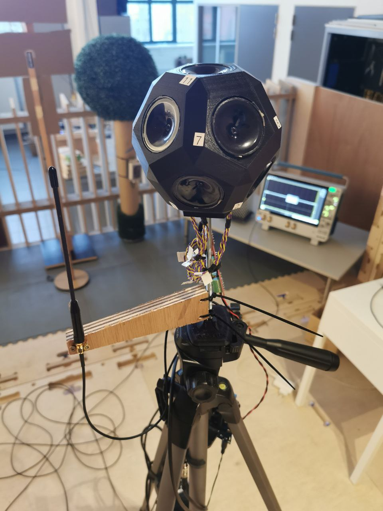

# Distrubuted non-coherent beamforming

Distributed non-coherent beamforming is a technique used in wireless communication and signal processing where multiple transmitters or antennas collaborate to transmit a signal without precise phase synchronization or coherent processing. In non-coherent beamforming, the individual transmitters or antennas do not need to have perfect knowledge of each other's phases or timing. This is in contrast to coherent beamforming, where the phase and timing of the signals from different transmitters are carefully synchronized to maximize constructive interference.

❗❗ script should be exectuted in Python on LINUX server

▶️ First test exectuted with vitual machine (Jarne)

✔️ First test executed --> see here for example plot

## Transmitter side 

**ToDo**
- **@Gilles** Make script with adaptable gain
- **@Gilles** Gain calibration (gain - tx power (dBm) ratio)
- **@geoffrey @gilles** How changing gain flexible for all USRPs

**INFO**

1) Equipment
- Techtile base infrastructure N tile with RPI + USRP + PSU
- Max. 280 path antennas (917 MHz) can be used for these measurements.
- (PPS and 10 MHz are not used, thus no frequency synchronisation)

2) Controlling Techtile transmitters (non coherent)

Start transmitters
```
ansible-playbook -i inventory/hosts.yaml start_waveform.yaml
```
Stop transmitters
```
ansible-playbook -i inventory/hosts.yaml kill-transmitter.yaml
```

## Receiver side

### Setup

The following image provides an overview of the acoustic transmitter for determining the location and the receiving antenna. The scope in the background receives the RF signals and determines the received power.



### More information

**ToDo**
- Combine 'location' script with 'RSS via scope' script

**INFO**
1) Equipment at the mobile receiver
- Receiver device --> Tektronix MSO64B
- Receive antenna --> 917 MHz dipole antenna
- Acoustic transmitter
- Tripod

2) Script to calculate receive power [dBm]

[Example code](https://github.com/techtile-by-dramco/experiments/blob/main/examples/read_MSO6.py)

3) Script to get location in Techtile
The location will be determined via acoustic system. Acoustic **transmitter** + **RX antenna** installed on same tripod.
- (DAQ + specific DAQ Windows PC) Running ZeroMQ script --> broadcasting 'timestamp' + 'xyz' location
- (Collecting locations via other PC) Receiving data via example code [receive location script](https://github.com/techtile-by-dramco/experiments/blob/main/01_distributed_non_coherent_beamforming/rx-loc-zmq.py)
