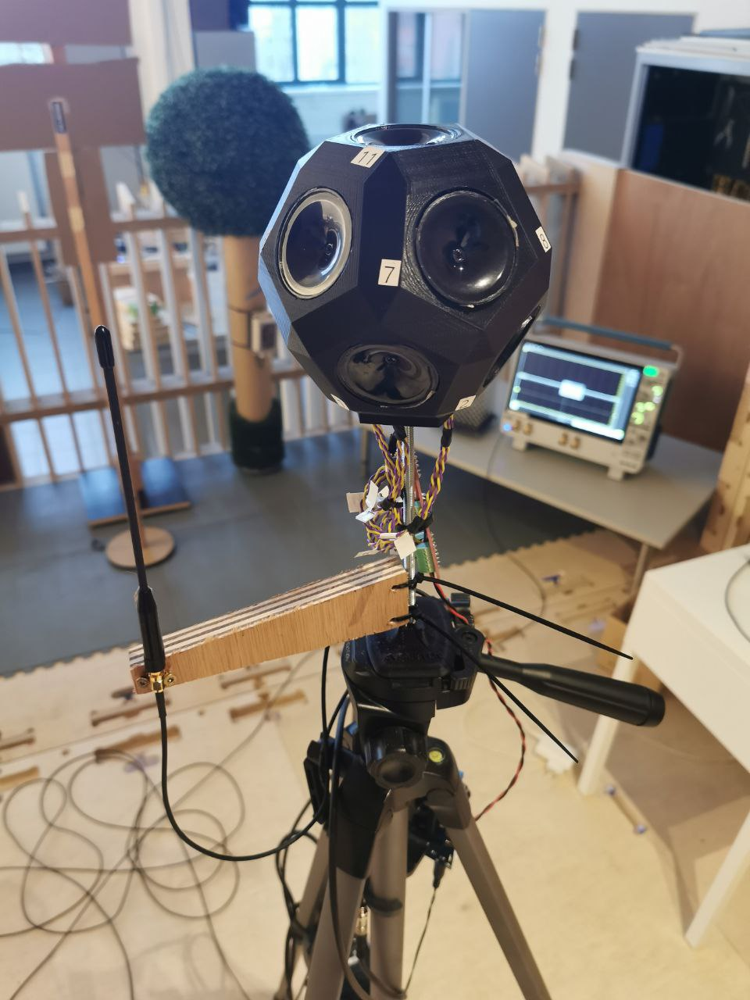

# Initial experiments

❗❗ script should be exectuted in Python on LINUX server

▶️ First test exectuted with vitual machine (Jarne)

✔️ First test executed --> [see here](#results) for example plots

## Transmitter side

### 1️⃣ Equipment
- Techtile base infrastructure N tile with RPI + USRP + PSU
- Max. 280 path antennas (917 MHz) can be used for these measurements.
- (PPS and 10 MHz are not used, thus no frequency synchronisation)

### 2️⃣ Controlling Techtile transmitters (non coherent)

Start transmitters
```
ansible-playbook -i inventory/hosts.yaml start_waveform.yaml -e "tiles=walls" -e "gain=100"
```
Stop transmitters
```
ansible-playbook -i inventory/hosts.yaml kill-transmitter.yaml -e tiles=walls"
```

## Receiver side

The following image provides a setup overview, consisting of the acoustic transmitter for determining the location and the receiver antenna. The scope in the background receives the RF signals and determines the received power.



More information of the receiver, see following requirements

### 1️⃣ Equipment at the mobile receiver
- Receiver device --> Tektronix MSO64B
- Receive antenna --> 917 MHz dipole antenna
- Acoustic transmitter
- Tripod
- Three cables required in current setup
  - Coax cable (scope - antenna)
  - 230VAC (PSU acoustic transmitter)
  - Audio cable (DAQ - acoustic transmitter)

### 2️⃣ RSS script (calculate receive power [dBm])

Communicate with the oscilloscope and apply Parseval’s Theorem of Fourier Transform.

- ⬛ See [example script](https://github.com/techtile-by-dramco/experiments/blob/main/examples/read_MSO6.py) combines all spectral components.
- ☑️ See [example script only peaks](https://github.com/techtile-by-dramco/experiments/blob/main/examples/read_MSO6_peaks_only.py) combines only spectral peaks.

### 3️⃣ Script to get location in Techtile
The location will be determined via acoustic system. Acoustic **transmitter** + **RX antenna** installed on same tripod.
- (DAQ + specific DAQ Windows PC) Running ZeroMQ script --> broadcasting 'timestamp' + 'xyz' location
- (Collecting locations via other PC) Receiving data via example code [receive location script](https://github.com/techtile-by-dramco/experiments/blob/main/01_distributed_non_coherent_beamforming/initial-experiments/rx-loc-zmq.py)


## Combined to perform measurements

Script [main.py](https://github.com/techtile-by-dramco/experiments/blob/main/01_distributed_non_coherent_beamforming/initial-experiments/main.py) combines following scripts:
- TX Ansible instructions to control Techtile transmitters
- RX **Location script**
- RX **RSS oscilloscope script**

## Results

| Gain | USRP TX power (per channel) | # active antennas | Total TX power | Average measured RX power | Link to plot |
|-|-|-|-|-|-|
| 100 | 18 dBm | 112 | 38.5 dBm | -4.3 dBm | [link plot gain 100](https://techtile-by-dramco.github.io/experiments/01_distributed_non_coherent_beamforming/initial-experiments/plot/1709111155_gain_100.html)
| 80 | 13.4 dBm | 112 | 33.9 dBm | -10.8 dBm | [link plot gain 80](https://techtile-by-dramco.github.io/experiments/01_distributed_non_coherent_beamforming/initial-experiments/plot/1709111890_gain_80.html)
| 65 | -0.4 dBm | 112 | 20.1 dBm | -25.5 dBm | [link plot gain 65](https://techtile-by-dramco.github.io/experiments/01_distributed_non_coherent_beamforming/initial-experiments/plot/1709112625_gain_65.html)


